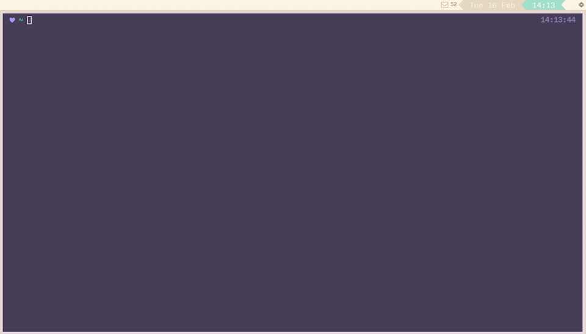

# snag [](https://github.com/b0o/snag/releases) [](https://opensource.org/licenses/GPL-3.0)

> snag screenshots and screencasts in sway

## Demo



## Install

TODO

## Usage

```
snag v0.0.1 (github.com/b0o/snag)

Usage: snag [opts] [-- [pass-thru opts ..]]

Options:
  General:
  -h           --help   Display usage information for snag.
  -v        --version   Output version.

  -x      --copy-path   Copy the output file path to the clipboard using
                        wl-copy.

  -N         --notify   Send a notification with the snag result on exit.

  -U <service> --upload Upload the output file.
                        [service] may be one of: drop, imgur (image only)

  -R           --rofi   Use rofi to present an interactive snag UI.

  Capture Mode:
  -I [format] --image   Capture a still image using grim.
                        This is the default mode.
                        [format] may be one of: png (default), jpeg, ppm.

  -V [format] --video   Capture a video using wf-recorder.
                         [format] may be one of: mp4 (default), gif, webm.

  Capture Region:

  If none of the following options are specified, the focused output will be
  captured by default.

  -r [region] --region  Capture a rectangular region.
                        [region] is of the form "<x>,<y> <width>x<height>"
                        If [region] is not specified, the user will be able to
                        select it graphically with the mouse via the slurp
                        utility.

  -c [id]   --container Capture a container.
                        [id] is a sway container ID.
                        If [id] is not specified, the user will be able to
                        select the target container graphically with the mouse.
                        If [id] is a the string 'foc' or 'focused', the
                        focused container will be used.

  -w [name] --workspace Capture a workspace.
                        [name] is a sway workspace name.
                        If [name] is not specified, the user will be able to
                        select the target workspace graphically with the mouse.
                        If [name] is a the string 'foc' or 'focused', the
                        focused workspace will be used.

  -o [output] --output  Capture an output.
                        [op] is a wayland output name.
                        If output is not specified, the user will be able to
                        select the target output graphically with the mouse.
                        If [foc] is a the string 'foc' or 'focused', the
                        focused output will be used.

  -a            --all   Capture all outputs.

  Output File:

  -d <dir> --dir        Save the screenshot in [dir].
                        Default: current working directory.

  -n <name>    --name   Use [name] as the literal output file name.
                        The default file name will be generated by the -f
                        format of "%Y-%m-%d_%H-%M-%S_{desc}.{ext}"

  -f <format> --namef   Use [format] to construct the output filename.

                        Sequences recognised by date(1) or the following will
                        be interpreted:

                        {ext}     the file extension as set in the -I / -V opts
                                  (without a leading .).

                        {desc}    a description of what was selected:
                                    - if a region was selected: "region"
                                    - if a window was selected:
                                      - wayland apps: window's app_id
                                      - xwayland apps: window's class property
                                    - if an output was selected: its name
                                    - if all outputs were selected: "all"

                        {region}  the captured region's coordinates, of the
                                  form "<x>,<y>_<width>x<height>".

To pass on arguments to the capture command (grim or wf-recorder), a -- can be
placed at the end of arguments meant for snag, and any remaining arguments will
be passed through to the capture command.

(c) 2020-2021 Maddison Hellstrom <github.com/b0o>

License: GPL-3.0-or-later (https://www.gnu.org/licenses/gpl-3.0.txt)
```

## License

&copy; 2020-2021 Maddison Hellstrom

Released under the GNU General Public License, version 3.0 or later.
